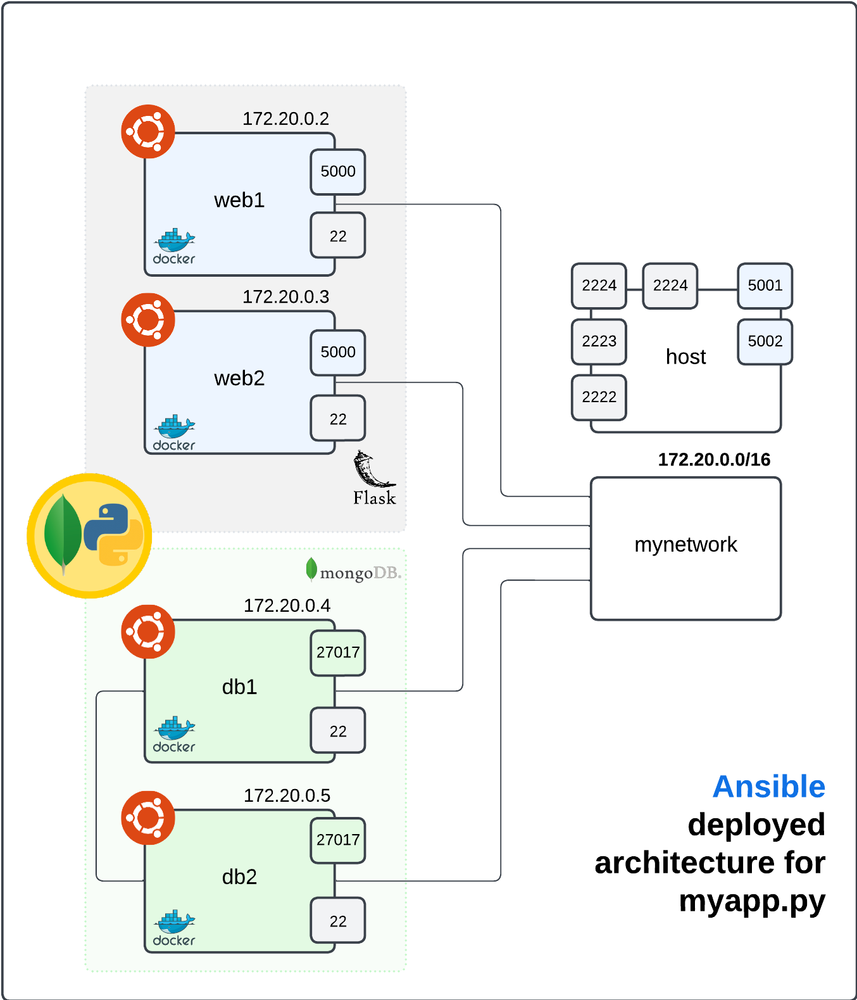

# Ansible Docker Project

Este proyecto implementa una pequeña arquitectura con dos servidores web y dos bases de datos. El objetivo es mostrar el funcionamiento y el potencial de uso de Ansible para el despliegue y fácil implementación de IaCs.


## Arquitectura

En la imagen de abajo se pude ver la arquitectura generada en base a los containers generados como luego el deploy de la aplicación que usa un ReplicaSet de mongodb para 


## Requisitos

Es necesario tener instalados:
- Docker
- Ansible
- Docker Compose

## Uso

```sh
git clone https://github.com/cijjas/Ansible-Docker-Project.git
cd Ansible-Docker-Project

```

### Launch Docker Containers

Este proyecto crea una simulación usando docker, para poder levantar los contenedores es necesario ejecutar el siguiente docker-compose:

```sh
# Start de los containers
docker-compose up -d

```

### Execute Playbook

Usando el playbook `site.yml` con el inventory `hosts.ini` comenzará ejecutando las tasks y finalmente se podrá ver en `http://127.0.0.1:5001` o bien `http://127.0.0.1:5002` la página web que permite hacer comentarios y dar likes a los comentarios.

```sh
ansible-playbook site.yml -i hosts.ini

```

## Semaphore Localmente

Si se quiere usar semaphore para visualizar el playbook en acción o bien enlazar un repositorio de github para poder hacer updates de los deploys recomendamos ver [este video](https://www.youtube.com/watch?v=CltoVfeRdoM) en profundiad que explica muy bien los conceptos.

si ya se configuró semaphore como dice el video simplemente iniciar el servicio, acceder al url `http://localhost:3000` y loggearse, luego se podrá configurar el repositorio deseado para ejecutar playbooks.

```sh

sudo systemctl start semaphore.service

sudo systemctl status semaphore.service

```
